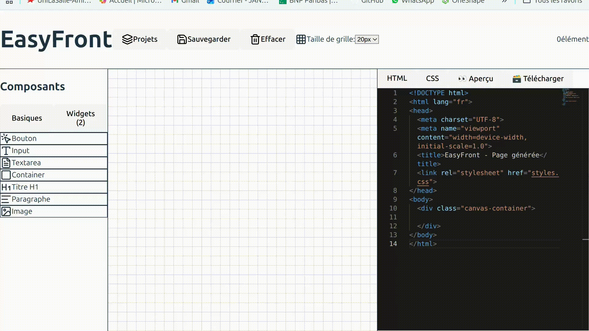

# How-To-Guides – Projet Editeur Visuel RIOC
Ce document explique comment installer, lancer et utiliser l'éditeur visuel RIOC, ainsi que les liens techniques utiles pour contribuer au projet.

---

# 1. Prérequis d’installation

## 1.1. Technologies nécessaires
Assurez-vous d’avoir installé :
- **Node.js ≥ 18**
- **npm ≥ 9**
- Un navigateur moderne (Chrome, Edge, Firefox)

Facultatif :
- VS Code (recommandé)
- Extension React Developer Tools
- Extension TailwindCSS IntelliSense

## 1.2. Installation du projet
Cloner le dépôt :
```bash
git clone https://github.com/Jean76-progr/Projet-RIOC.git
```

Accéder au dossier du projet React (Editeur Visuel) :
```bash
cd Projet-RIOC
```

Installer les dépendances :
```bash
npm install
```

---

# 2. Démarrer le projet
Lancer le serveur de développement :
```bash
npm run dev
```

Par défaut, Vite ouvre le projet à l’adresse :
```
http://localhost:5173
```
Si la page ne s’ouvre pas automatiquement, vous pouvez la copier-coller dans votre navigateur.

---

# 3. Structure du projet et fichiers importants
```txt
Editeur-Visuel/
│
├── src/
│   ├── components/
│   │   ├── Canvas/              → Rendu et gestion visuelle du canvas
│   │   ├── Sidebar/             → Liste des éléments glissables
│   │   ├── DraggableElement/    → Logique du drag-and-drop
│   │   └── CodeEditor/          → Intégration de Monaco Editor
│   │
│   ├── db/                      → Dexie.js / IndexedDB pour les projets
│   ├── store/                   → Zustand : état global (éléments, sélection, etc.)
│   ├── utils/                   → Fonctions de génération HTML/CSS
│   └── types/                   → Types TypeScript (Element, Project…)
│
├── public/
├── package.json
└── vite.config.ts
```

**Les dossiers essentiels :**
- **Canvas** : Gère l’affichage, le positionnement et la sélection d’éléments.
- **Sidebar** : Permet de glisser des widgets préconçus sur le Canvas.
- **store/** : Le centre logique du projet (Zustand) :
  - Ajout d’éléments
  - Suppression
  - Mouvement
  - Propriétés
  - Génération
- **db/** : Stocke automatiquement les projets dans IndexedDB, localement dans le navigateur.
- **utils/** : Convertit la structure visuelle en code HTML + CSS.

---

# 4. Comptes, accès et données par défaut
Aucun système de compte n’est requis.
Les données sont stockées **localement**, via IndexedDB.
Vous pouvez réinitialiser les données en vidant le stockage du navigateur :
Chrome → Outils Dev → Application → IndexedDB → Delete

---

# 5. Exemple d’utilisation



## Exemple complet (du drag au code)
1. Lancer l’éditeur :
   ```bash
   npm run dev
   ```
2. Dans la **Sidebar**, prendre un composant (ex : texte, div, bouton).
3. Le déposer sur le **Canvas**.
4. Le sélectionner pour modifier ses propriétés :
   - position
   - taille
5. Ouvrir l’onglet **Code** pour voir le code HTML / CSS généré automatiquement.
6. Sauvegarde :
   Le projet est enregistré automatiquement dans la base locale IndexedDB.
7. Export :
   Possibilité de copier le code généré ou de l’envoyer vers un futur module d’export ZIP.
---

# 6. Problèmes connus
- Le drag-and-drop peut être perturbé si des widgets externes introduisent des listeners globaux.
- Monaco Editor peut être lent la première fois (chargement Web Workers).
- IndexedDB dépend du navigateur (éviter navigation privée).

---

# 7. Documentation externe utile
- React : [https://react.dev/](https://react.dev/)
- Zustand : [https://zustand-demo.pmnd.rs/](https://zustand-demo.pmnd.rs/)
- dnd-kit : [https://docs.dndkit.com/](https://docs.dndkit.com/)
- Dexie.js : [https://dexie.org/](https://dexie.org/)
- Monaco Editor : [https://microsoft.github.io/monaco-editor/](https://microsoft.github.io/monaco-editor/)
- TailwindCSS : [https://tailwindcss.com/](https://tailwindcss.com/)
- Vite.js : [https://vitejs.dev/](https://vitejs.dev/)

---
